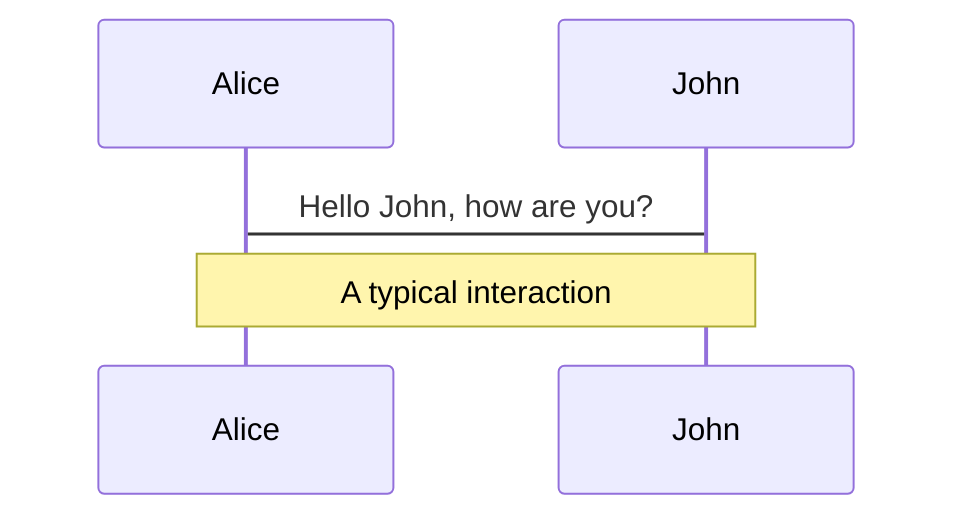
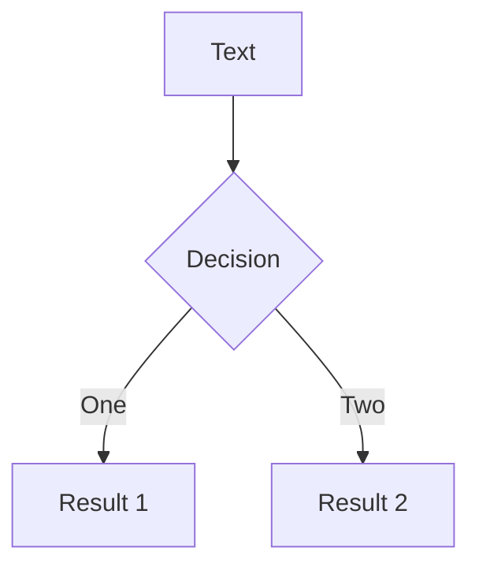
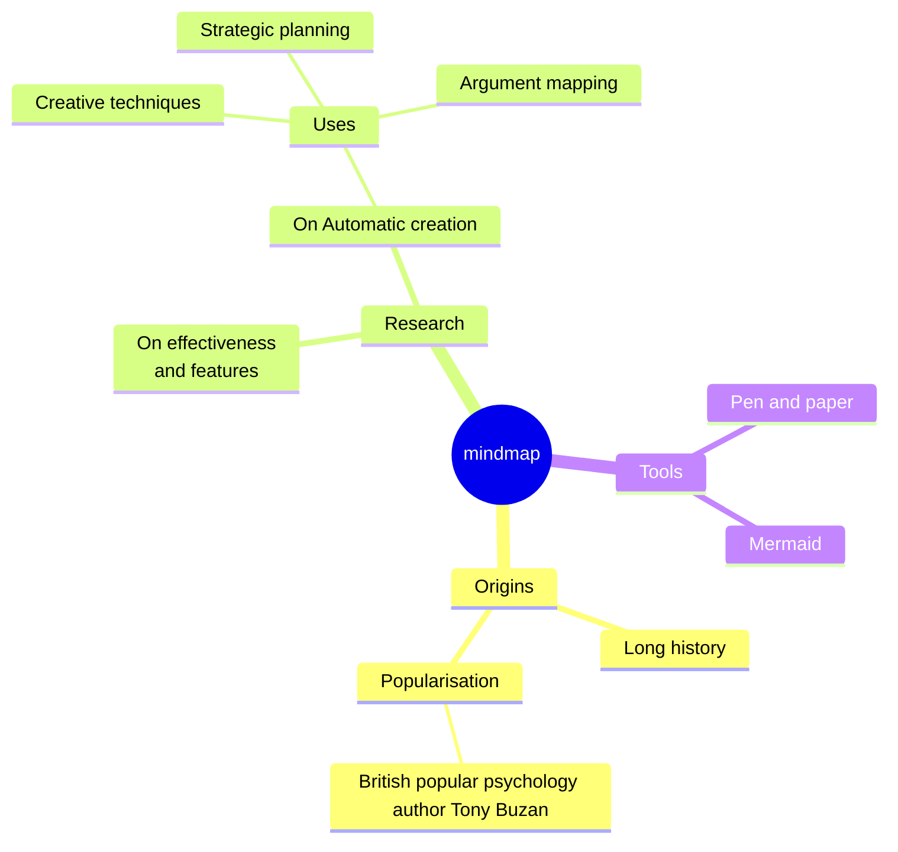
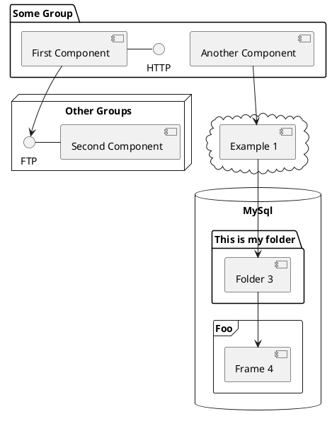

---
# You can also start simply with 'default'
# theme: seriph
theme: apple-basic
# random image from a curated Unsplash collection by Anthony
# like them? see https://unsplash.com/collections/94734566/slidev
background: https://cover.sli.dev
# some information about your slides (markdown enabled)
title: SRRQR
info: |
  ## Slidev Starter Template
  Strong Rank Revealing QR factorization.

  Learn more at [Sli.dev](https://sli.dev)
# apply unocss classes to the current slide
class: text-center py-6
# https://sli.dev/features/drawing
drawings:
  persist: false
# slide transition: https://sli.dev/guide/animations.html#slide-transitions
transition: fade-out
math: true
# enable MDC Syntax: https://sli.dev/features/mdc
mdc: true
# open graph
# seoMeta:
#  ogImage: https://cover.sli.dev
---


<div class="heading"> SRRQR </div>

A Presentation 


<!--
The last comment block of each slide will be treated as slide notes. It will be visible and editable in Presenter Mode along with the slide. [Read more in the docs](https://sli.dev/guide/syntax.html#notes)
-->

---


## What's the need?


<div class="answer" v-click="1">
We know SVD represents the <span style="color: goldenrod; font-weight: bold;">gold-standard</span> in the area of rank-determination. Nothing "takes apart" a matrix so conclusively as the SVD. <em>(Golub, 5.4)</em>.
</div>

<div class="answer" v-click="2">
We know that QR is a much more efficient operation compared to SVD.
</div>

<div v-click="3" class="answer">
<span  v-motion :initial="{ opacity: 0 }" :enter="{ opacity: 1, transition: { duration: 1500, easing: 'ease-in-out' } }"><em>Imagine</em></span></div>
<div class="answer" v-click="4"> if it can also produce rank.
</div>

<!--
You can have `style` tag in markdown to override the style for the current page.
Learn more: https://sli.dev/features/slide-scope-style
-->


---


## Why do we care about rank?
<br>

<div class="answer" style="text-align-last:left; margin:1rem">

$Least-Squares$

$Subset \ Selection$

$Linear \ Dependency \ Analysis$

$etc...$
</div>

<br>

<div class="answer" v-click>The first algorithm that utilizes QR and produces a rank was introduced by Golub, with Bussinger  (1965)</div>

---
layout: fact
class: px-30
---

Given a matrix $M \in R^{m X n}$ with $m \geq n$, we consider a QR factorisation of the form: 

<span style="color: goldenrod; font-weight: bold; font-size:2rem">$M\Pi = QR = Q\begin{pmatrix} A_k & B_k \\ 0 & C_k \end{pmatrix}$.</span>

Also, assume that the $\sigma_i(M)$ of M are arranged in decreasing order:

$\sigma_1(M) \geq \sigma_2(M) \geq \sigma_3(M) ... \sigma_n(M)$
<br>
<br>
<br>
<br>
<v-click> 

It's **QR With Column Pivoting**. You must've already seen this in class.


</v-click>


---


## Algorithm 1. QR with column pivoting
<br>
<div class="katex-block">
$$
\begin{array}{ll}
k := 0;\quad R := M;\quad \Pi := I; \\[0.5em]
\textbf{while } \max_{1 \le j \le n - k} \gamma_j\big(C_k(R)\big) \ge \delta \ \textbf{do} \\[0.5em]
\quad j_{\text{max}} := \arg\max_{1 \le j \le n - k} \gamma_j\big(C_k(R)\big); \\[0.5em]
\quad k := k + 1; \\[0.5em]
\quad \text{Compute } R := \mathcal{R}_k\big(R \, \Pi_{k, \ k + j_{\text{max}} - 1}\big)\ \text{ and } \ \Pi := \Pi \, \Pi_{k, \ k + j_{\text{max}} - 1}; \\[0.5em]
\textbf{endfor;}
\end{array}
$$
</div>

---

cue for some animation for how its happening 
<v-click>

There are 2 buckets. Initially, the left bucket contains no columns. The right bucket contains all the columns. As we progress, we find the column with the maximum norm that is greater than <code>δ</code> from the right bucket and place it in the left bucket.

</v-click>

<v-click>

These buckets indicate the first $k$ columns of matrix and the rest of the columns, respectively.

$$
\begin{array}{c}
  
  \begin{bmatrix}
    a_{11} &\ \ a_{12} &\ \  a_{13} &\ \  a_{14} &\ \ a_{15} &\ \ a_{16} \\
    a_{21} &\ \ a_{22} &\ \  a_{23} &\ \  a_{24} &\ \ a_{25} &\ \ a_{26} \\
    a_{31} &\ \ a_{32} &\ \  a_{33} &\ \  a_{34} &\ \ a_{35} &\ \ a_{36} \\
    a_{41} &\ \ a_{42} &\ \  a_{43} &\ \  a_{44} &\ \ a_{45} &\ \ a_{46} \\
    a_{51} &\ \ a_{52} &\ \  a_{53} &\ \  a_{54} &\ \ a_{55} &\ \ a_{56} \\
    a_{61} &\ \ a_{62} &\ \  a_{63} &\ \  a_{64} &\ \ a_{65} &\ \ a_{66} \\
  \end{bmatrix} \\
  \underbrace{\hspace{1.8em}}_{\text{col 1}} \quad
  \underbrace{\hspace{1.8em}}_{\text{col 2}} \quad
  \underbrace{\hspace{1.8em}}_{\text{col 3}} \quad
  \underbrace{\hspace{1.8em}}_{\text{col 4}} \quad
  \underbrace{\hspace{1.8em}}_{\text{col 5}} \quad
  \underbrace{\hspace{1.8em}}_{\text{col 6}} \\
\end{array}
$$

</v-click>

---


## Why are we doing this pivoting?

<br>
<div v-click class="answer">
To gather the well-conditioned columns in the left-bucket and the rest on the right bucket. Once concluded, the number of columns in the left-bucket is the rank of the matrix.
</div>


---


## What do we mean by gathering the well-conditioned columns in the left? 
<br>
<div v-click class="answer">

It means that we're trying to greedily maximise of determinant of $A_k$
</div>

---


## Why do we want to maximise the $det(A_k)$?

<div v-click class="answer">

Assume that $k$ is a given integer such that $1 \leq k \lt n$ and $\sigma_k(M) > 0$. If $\sigma_(M)$ and $\sigma_{k+1}(M)$ are *well-separated*, and $\sigma_{k+1}(M)$ is small, of $O(\epsilon)$, then $k$ is considered the *Numerical Rank*. Therefore the RRQR problem can be precisely formulated as:
<br>

1. 1.$\; \max_{\pi}\sigma_{\min}(A_k)$
2. 2.$\; \min_{\pi}\sigma_{\max}(C_k)$
3. 3.$\; \text{Or Solving Both}$
<br>

Therefore, it suffices to maximise the determinant because it is a product of singular values.
</div>


---

$$
\left[
\begin{array}{cccc:cccc}
a_{11} & a_{12} & \cdots & \cdots & \cdots & a_{1,n-1} & a_{1,n} \\[0.5em]
0 & a_{22} & \cdots & \cdots & \cdots \\
\vdots & \vdots & \ddots\\
\vdots & \vdots &  & a_{kk} \\[0.5em]
\hdashline
\vdots & \vdots & \cdots & \cdots & a_{k+1,k+1} \\
\vdots & \vdots & \cdots & \cdots &\ \ \ \ \ \ \ \ \ \ddots \\
\vdots & \vdots & \cdots & \cdots & \cdots &  a_{n-1,n-1} \\[0.5em]
0 & \cdots & \cdots & \cdots & \cdots & 0 & a_{n,n}
\end{array}
\right]
$$


---

## **Low Rank Approximation**:
<br>

<div class="answer-small">

  1. *SVD* : If you want Rank-K approximation, take $\sum_{i=1}^{k}\sigma_i u_i v_i^T$
   <br><br>

  2. *RRQR* : $||A - Q_{m \times k} \begin{bmatrix} A_k & B_k \end{bmatrix} \Pi^T||_2 = ||C_k||_2$ 
</div>
<br>
<div class="highlighted-question">

*Another way to think about why do we want to maximize* $det(A_k)$ *and equivalently minimise $det(C_k)$?*
</div>
<div class="answer-small">

Because we seek to minimise the error $||C_k||_2$
</div>

---

## **Why do we want to find the column with maximum norm in $C_k$ and bring it to the 1st bucket?** 
<br>

Because, we can prove 
$$ \sigma_{\max}(C_k(M\Pi)) \leq \sqrt{n-k} \max_{1 \leq j \leq n-k} \gamma_j(C_k(M\Pi)) \leq \sqrt{n-k} \space \delta $$

If $\delta$ is small, then the numerical rank is atmost $k$ and our objective is acheived.


---

Cue for Application-1: The Olivetti, where we showcase the speed of QRCP in contrast to SVD. !!Add the FLOPs here!!
<Camera />

---


## **RRQR Conditions**: 
<br>
<div class="text-xl">

$$ \sigma_{\min}(A_k) \geq \frac{\sigma_k(M)}{p(k,n)} \tag{1} $$
$$ \sigma_{\max}(C_k) \leq \sigma_{k+1}(M) \space p(k,n) \tag{2} $$
</div>

<div class="description">

where $p(k,n)$ is a function bounded by a low-degree polynomial in $k$ & $n$.

An Algorithm is called RRQR if it satisfied both conditions.
</div>

## **Our Interpretation**: 

<div class="description">

We know that $\sigma_{\min}(A_k) \leq \sigma_k(M)$ and $\sigma_{\max}(C_k) \geq \sigma_{k+1}(M)$. The RRQR Conditions additionally wants the the singular values to be close.
</div>

---
layout: center
---

<slide src="./slides/matrix-visual.md" />


---
clicks: 3
---


Cue for a good RRQR Factorisation where QRCP works well and and use that to show that condition-1 is being satisified.
<div class="katex-block" v-if="$slidev.nav.clicks ===  0">
5x5 matrix
$$
\begin{array}{c}
  \left(
  \begin{matrix}
    \ \ \ {1} &\ \ \ {2} &\ \ \  {0} &\ \ \  {3} &\ \ \ {4} \ \ \ \\
    \ \ \ {2} &\ \ \ {4} &\ \ \  {1} &\ \ \  {7} &\ \ \ {9} \ \ \ \\
    \ \ \ {3} &\ \ \ {6} &\ \ \  {1} &\ \ \  {10} &\ \ \ {13} \ \ \ \\
    \ \ \ {4} &\ \ \ {8} &\ \ \  {2} &\ \ \  {13} &\ \ \ {17} \ \ \ \\
    \ \ \ {5} &\ \ \ {10} &\ \ \  {2} &\ \ \  {16} &\ \ \ {21} \ \ \
  \end{matrix} \right) \\
  \ \ \ \ \underbrace{\hspace{1em}}_{\sqrt{55}} \quad
  \underbrace{\hspace{1em}}_{\sqrt{220}} \quad
  \underbrace{\hspace{1em}}_{\sqrt{10}} \quad
  \underbrace{\hspace{1em}}_{\sqrt{583}} \quad
  \underbrace{\hspace{1em}}_{\sqrt{996}} \quad \\
\end{array}
$$
</div>

<div class="katex-block" v-if="$slidev.nav.clicks === 1">
after swaping columns
$$
\begin{array}{c}
  \left(
  \begin{matrix}
    \ \ \ {4} &\ \ \ {2} &\ \ \  {0} &\ \ \  {3} &\ \ \ {1} \ \ \ \\
    \ \ \ {9} &\ \ \ {4} &\ \ \  {1} &\ \ \  {7} &\ \ \ {2} \ \ \ \\
    \ \ \ {13} &\ \ \ {6} &\ \ \  {1} &\ \ \  {10} &\ \ \ {3} \ \ \ \\
    \ \ \ {17} &\ \ \ {8} &\ \ \  {2} &\ \ \  {13} &\ \ \ {4} \ \ \ \\
    \ \ \ {21} &\ \ \ {10} &\ \ \  {2} &\ \ \  {16} &\ \ \ {5} \ \ \
  \end{matrix} \right) \\
  \ \ \ \ \underbrace{\hspace{1em}}_{\sqrt{996}} \quad
  \underbrace{\hspace{1em}}_{\sqrt{220}} \quad
  \underbrace{\hspace{1em}}_{\sqrt{10}} \quad
  \underbrace{\hspace{1em}}_{\sqrt{583}} \quad
  \underbrace{\hspace{1em}}_{\sqrt{55}} \quad \\
\end{array}
$$
</div>

<div class="katex-block" v-if="$slidev.nav.clicks === 2">
after applying householder on first column
$$
\begin{array}{c}
  \left(
  \begin{matrix}
    \ \ \ {\sqrt{996}}  &\ \ \ {20.199} &\ \ \  {4.437} &\ \ \  {25.318} &\ \ \ {6.329} \ \ \ \\
    \ \ \ {0} &\ \ \ {-1.633} &\ \ \  {-0.816} &\ \ \  {-3.265} &\ \ \ {-1.225} \ \ \ \\
    \ \ \ {0} &\ \ \ {-1.225} &\ \ \  {-0.612} &\ \ \  {-2.449} &\ \ \ {-0.918} \ \ \ \\
    \ \ \ {0} &\ \ \ {-0.816} &\ \ \  {-0.408} &\ \ \  {-1.633} &\ \ \ {-0.612} \ \ \ \\
    \ \ \ {0} &\ \ \ {-0.405} &\ \ \  {-0.204} &\ \ \  {-0.816} &\ \ \ {-0.306} \ \ \
  \end{matrix} \right) \\
\end{array}
$$
</div>

---
class: py-20
---

<div class="text-2xl">
Essentially, QRCP, which is a greedy algorithm, as defined by Golub, is an approximation of another Greedy Algorithm which solves Problem-I.
</div>

<br><br><br><br>

<v-click>
<div style="font-size: 3rem; text-align-last: center; color: #2B90B6; font-family: Helvetica Neue; text-transform: uppercase;">

**What is that Greedy Algorithm?**
</div>  
</v-click>

---
class: py-6
---

## Alogrithm Greedy-I

<div class="katex-block">

$$ {all|7}
\begin{array}{l}
R^{(0)} = R \\[0.5em]

\textbf{For } l = 0 \text{ to } k - 1 \text{ do:} \\[0.5em]


\text{Set} \\ \quad
\begin{array}{cc}
& \begin{array}{cc} \ \ \ l & n - l \end{array} \\
\begin{array}{c} l \\ n - l \end{array} &
\left( \begin{array}{cc}
A & B \\
C &
\end{array} \right)
\end{array}
= \ \  R^{(l)} \\[1.9em] 

\text{Denote the columns of } B \text{ and } C \text{ by } b_i = B e_i \ \ and \ \ c_i = C e_i \\[0.7em]

\quad\quad 1. \ \text{Find the next column } l + j \text{ of } R^{(l)} \text{ such that:} \\[0.5em]

\quad\quad\quad \max_{1 \leq i \leq n - l} \, \sigma_{\min} 
\begin{pmatrix}
A & b_i \\
  & c_i
\end{pmatrix}
= \sigma_{\min}
\begin{pmatrix}
A & b_j \\
  & c_j
\end{pmatrix} \\[1.2em]

\quad\quad 2. \ \text{Exchange columns } l+1 \text{ and } l+j \text{ of } R^{(l)}, \text{ and retriangularize from the left} \\[0.5em]
\quad\quad\quad \text{with orthogonal transformations to get } R^{(l+1)}
\end{array}
$$
</div>

---

Since, it's an approximation, you can cook-up an example, where it fails, and here it is.

kahan?


---

Now, the pertinent question, 
## **Why is Norm a good-approximation to Singular Value?** 

<div class="answer">
Because this is true: 

<br>

$$
\frac{\alpha_{l+1}}{\sqrt{n - l}} \leq \gamma_j \leq \alpha_{l+1}, \quad 
\alpha_{l+1} = \max_{1 \leq i \leq n - l} \gamma_i
$$
</div>

---


Cue for Kahan's Entry: Show $5 \times 5$ formulation of Kahan. Extend it to $S_{300}(0.9)$ and show how Kahan fails to produce the rank as $n-1$ but instead says it is a full-rank matrix. (Golub, 5.4.3.). Nevertheless, in practice, small trailing R-submatrices almost always emerge that correlate well with the underlying rank. In other words, it is almost always the case $R_{22}^k$ is small if A has rank k.
$$
\begin{array}{c}
  
  \begin{bmatrix}
    a_{11} &\ \ a_{12} &\ \  a_{13} &\ \  a_{14} &\ \ a_{15} &\ \ a_{16} \\
    a_{21} &\ \ a_{22} &\ \  a_{23} &\ \  a_{24} &\ \ a_{25} &\ \ a_{26} \\
    a_{31} &\ \ a_{32} &\ \  a_{33} &\ \  a_{34} &\ \ a_{35} &\ \ a_{36} \\
    a_{41} &\ \ a_{42} &\ \  a_{43} &\ \  a_{44} &\ \ a_{45} &\ \ a_{46} \\
    a_{51} &\ \ a_{52} &\ \  a_{53} &\ \  a_{54} &\ \ a_{55} &\ \ a_{56} \\
    a_{61} &\ \ a_{62} &\ \  a_{63} &\ \  a_{64} &\ \ a_{65} &\ \ a_{66} \\
  \end{bmatrix} \\
  \underbrace{\hspace{1.8em}}_{\text{1}} \quad
  \underbrace{\hspace{1.8em}}_{\text{1}} \quad
  \underbrace{\hspace{1.8em}}_{\text{1}} \quad
  \underbrace{\hspace{1.8em}}_{\text{1}} \quad
  \underbrace{\hspace{1.8em}}_{\text{1}} \quad
  \underbrace{\hspace{1.8em}}_{\text{1}} \\
\end{array}
$$

---
clicks: 3
---

<div v-if="$slidev.nav.clicks >=0 && $slidev.nav.clicks <=3">

<div v-if="$slidev.nav.clicks >=0 && $slidev.nav.clicks <3" class="answer">
We know that the previously mentioned algorithms solve Problem-I. 
</div>

<div v-if="$slidev.nav.clicks >=1 && $slidev.nav.clicks <3" class="answer">
This begs the questions, will we fare better if the problem-II is also solved simulatenously?
</div>

<div v-if="$slidev.nav.clicks >=2 && $slidev.nav.clicks <3" class="answer">
Does this mean we need specialized algorithms for Problem-II?
</div>

</div>

<div  v-if="$slidev.nav.clicks >=3" class="answer" style="color: red; margin: 10rem 9rem; font-size: 7rem">
NO!
</div>

---
class: py-8
---


## **The Unification Principle**: 
<br>
<div class="text-xl">
Earlier, we said there are 2 kinds of problems we're trying to solve.	

$$ \max_{\pi}\sigma_{\min}(A_k) \tag{1} $$

$$ \min_{\pi}\sigma_{\max}(C_k) \tag{2} $$ 

The Golub's QRCP solves Problem-I. For solving Problem-II, there may exist algorithms, but with slight change in perspective, we can repurpose the Algorithms for Problem-I to solve Problem-II.

Since,
$$
\min_{\pi}\sigma_{\max}(C_k) = \min_{\pi}\frac{1}{\sigma_{\min}(C_k^{-1})} \\[0.6em]
=> \frac{1}{\max_{\pi}\sigma_{\min}(C_k^{-1})} = \frac{1}{\max_{\pi}\sigma_{\min}(C_k^{-T})}
$$

Hence, solving Problem-II is equivalent to solving Problem-I for the inverse.
</div>


---


Running the Algorithm to solve Problem-I and Algorithm to solve Problem-II in alteration will lead to the 2nd Algorithm of this paper, and the quintessential algorithm of RRQR Paper, which produces a Robust RRQR Factorization that adheres to the RRQR Conditions given a $k$  

---
class: py-5
clicks: 2
---

### Algorithm 2: Hybrid-III$(k)$
<div class="katex-block" v-if="$slidev.nav.clicks >= 0 && $slidev.nav.clicks <1">

$$
\begin{array}{ll}
R := M; \quad \Pi := I \\
\textbf{repeat} \\[0.15em]
\quad\quad i_{\min} := \arg\min_{1 \leq i \leq k} \, \omega_i(A_k(R)) \\[0.5em]
\quad\quad \textbf{if} \ \text{there exists a } j \ \text{such that} \ 
\frac{\det[\mathcal{A}_k(R\ \Pi_{i_{\min},\ j+k})]}{\det[\mathcal{A}_k(R)]} > 1 \ \textbf{then} \\[0.5em]

\quad\quad\quad \text{Find such a } j \\[0.25em]
\quad\quad\quad \text{Compute } R := \mathcal{R}_k(R \, \Pi_{i_{\min},\ j+k}) \ and \  \Pi := \Pi \, \Pi_{i_{\min},\ j+k} \\[.15em]
\quad\quad \textbf{endif} \\

\quad\quad j_{\max} := \arg\max_{1 \leq j \leq n-k} \, \gamma_j(C_k(R)) \\[0.5em]

\quad\quad \textbf{if} \ \text{there exists an } i \ \text{such that} \ 
\frac{\det[\mathcal{A}_k(R\ \Pi_{i,\ j_{\max}+k})]}{\det[\mathcal{A}_k(R)]} > 1 \ \textbf{then} \\[0.25em]

\quad\quad\quad \text{Find such an } i \\[0.25em]
\quad\quad\quad \text{Compute } R := \mathcal{R}_k(R \, \Pi_{i,\ j_{\max}+k}) \ and \ \Pi := \Pi \, \Pi_{i,\ j_{\max}+k} \\[0.15em]
\quad\quad \textbf{endif} \\

\textbf{until} \ \text{no interchange occurs}
\end{array}
$$
</div>


<div class="katex-block" v-motion :initial="{ opacity: 0, y: 10 }" :enter="{ opacity: 1, y: 0, transition: { duration: 600 } }" v-if="$slidev.nav.clicks >= 1 && $slidev.nav.clicks <2">

$$ {1}
\begin{array}{l}
\quad i_{\min} := \arg\min_{1 \leq i \leq k} \, \omega_i(A_k(R)) \\[0.5em]
\quad \textbf{if} \ \text{there exists a } j \ \text{such that} \ 
\frac{\det[\mathcal{A}_k(R\ \Pi_{i_{\min},\ j+k})]}{\det[\mathcal{A}_k(R)]} > 1 \ \textbf{then} \\[0.5em]

\quad\quad \text{Find such a } j \\[0.25em]
\quad\quad \text{Compute } R := \mathcal{R}_k(R \, \Pi_{i_{\min},\ j+k}) \ and \  \Pi := \Pi \, \Pi_{i_{\min},\ j+k} \\[.15em]
\quad \textbf{endif}
\end{array}
$$
</div>
<div class="answer-small" v-if="$slidev.nav.clicks >= 1 && $slidev.nav.clicks <2">

Since, the objective is to find a $\Pi$ for which $\sigma_{\min}(A_k(M\Pi))$ is sufficiently large and $\sigma_{\max}(C_k(M\Pi))$ is sufficiently small, the above Algorithm keeps interchanging the most **_dependent_** of the first $k$ columns with one of the last $n-k$ columns
</div>

<div class="katex-block" v-motion :initial="{ opacity: 0, y: 10 }" :enter="{ opacity: 1, y: 0, transition: { duration: 600 } }" v-if="$slidev.nav.clicks >= 2 && $slidev.nav.clicks <3">

$$ {1}
\begin{array}{l}
\quad\quad j_{\max} := \arg\max_{1 \leq j \leq n-k} \, \gamma_j(C_k(R)) \\[0.5em]

\quad\quad \textbf{if} \ \text{there exists an } i \ \text{such that} \ 
\frac{\det[\mathcal{A}_k(R\ \Pi_{i,\ j_{\max}+k})]}{\det[\mathcal{A}_k(R)]} > 1 \ \textbf{then} \\[0.25em]

\quad\quad\quad \text{Find such an } i \\[0.25em]
\quad\quad\quad \text{Compute } R := \mathcal{R}_k(R \, \Pi_{i,\ j_{\max}+k}) \ and \ \Pi := \Pi \, \Pi_{i,\ j_{\max}+k} \\[0.15em]
\quad\quad \textbf{endif}
\end{array}
$$
</div>
<div class="answer-small" v-if="$slidev.nav.clicks >= 2 && $slidev.nav.clicks <3">

And interchanging the most **_independent_** of the last $n-k$ columns with one of the first $k$ columns, as long as $\det[A_K(R)]$ is strictly increases.
</div>


---


## Why will **Algorithm-2** Halt?
<br>
<div class="answer">

Since, $\det[A_K(R)]$ strictly increases with every interchange, no permutation repeats; and since there are only a finite number of permutations, Algorithm-2 eventually halts.
</div>


---


**In the second if-loop of Algorithm-2, why does the norm of the column act as a proxy to the independence of the column in $C_k$?**


---


**In the first if-loop of Algorithm-2, why does the norm of the row of the inverse act as a proxy to the dependence of the column in $A_k$?**


---


Chandrasekhar and Ipsen show that the above Algorithm computes an RRQR Factorisation given $k$

But, Algorithm-2 may not compute SRRQR. Cue the Example:2


---


## **Digression**: 
<br>
<div class="text-xl leading-loose">

The Basic Solution of the Rank-Deficient Least-Squares Problem using QRCP involved $A_k^{-1}B_k$.<br><br>
We think that the conditions laid out in the RRQR paper are deficient in this additional condition, where we bound the entries of $A_k^{-1}B_k$ and infact the well-conditionality of $A_k$.<br><br> Because of this, the RRQR factorization cannot guarantee 
$\Pi\begin{bmatrix} -R_{11}^{-1}R_{12} \\ I_{n-k} \end{bmatrix}$
to be a stable approximation of the right null space of M
</div>


---


Cue: Introduce the Least Squares Demo, if any.


---


## **SRRQR Conditions**: 
<br>
<div class="text-xl">

$$
\sigma_{i}(A_k) \geq \frac{\sigma_i(M)}{q_1(k,n)} \tag{1}
$$

$$
\sigma_{j}(C_k) \leq \sigma_{k+j}(M)\ q_1(k,n) \tag{2}
$$

$$
\left|(A_k^{-1}B_k)_{i,j}\right| \leq q_2(k,n) \tag{3}
$$
</div>   

<br>
<div class="description">

In addition to the reason we've given for the introduction of the bound for $A_k^{-1}B_k$, we think that the alteration in conditions (1) and (2) makes the SRRQR enforce a tighter bound on every singular value of the matrix and not just the minimum singular of $A_k$ and the maximum singular value of $C_k$
</div>

---

## **SRRQR - 1**: 

### Algorithm 3: Compute a strong RRQR factorization, given $k$
<div class="katex-block">

$$
\begin{array}{ll}
\textbf{Algorithm 3:} \text{Compute a strong RRQR factorization, given } k \\[0.9em]

R := \mathcal{R}_k(M); \quad \Pi := I \\[0.9em]

\textbf{while} \ \text{there exist } i \text{ and } j \text{ such that } \frac{\det(\bar{A}_k)}{\det(A_k)} > f, \\[0.9em]
\quad \text{where } R = \begin{pmatrix} A_k & B_k \\ & C_k \end{pmatrix} \text{ and } \mathcal{R}_k(R \, \Pi_{i,j+k}) = \begin{pmatrix} \bar{A}_k & \bar{B}_k \\  & \bar{C}_k \end{pmatrix}, \ \textbf{do} \\\\

\quad \text{Find such an } i \text{ and } j \\\\

\quad \text{Compute } R := \mathcal{R}_k(R \, \Pi_{i,j+k}) \text{ and } \Pi := \Pi \, \Pi_{i,j+k} \\\\

\textbf{endwhile}
\end{array}
$$
</div>

---


## **What does this do differently**?
<br>
<div class="answer">

While Algorithm 2 interchanges either the most "dependent" column of $A_k$ or the most "independent" column of $C_k$, **SRRQR-1** interchanges any pair of columns that sufficiently increases $\det(A_k)$.
</div>

---
layout: fact
---


<!-- ## **Lemma**:  -->

$$
\frac{\det(\bar{A}_k)}{\det(A_k)} = \sqrt{(A_k^{-1} B_k)_{i,j}^2 + \left( \frac{\gamma_j(C_k)}{\omega_i(A_k)} \right)^2}
$$
<br>
Define,

$$
\rho(R, k) = \max_{\substack{1 \leq i \leq k \\\\ 1 \leq j \leq n - k}} 
\sqrt{(A_k^{-1} B_k)_{i,j}^2 + \left( \frac{\gamma_j(C_k)}{\omega_i(A_k)} \right)^2}
$$


---
clicks: 3
---

## **SRRQR-2**:
<div class=" katex-block" v-if="$slidev.nav.clicks >= 0 && $slidev.nav.clicks <1">

### Algorithm 4: Compute a strong RRQR factorization, given $k$
$$
\begin{array}{ll}
\text{Compute } R \equiv \begin{pmatrix} A_k & B_k \\ C_k \end{pmatrix} := \mathcal{R}_k(M), \quad \Pi := I \\[0.9em]
\textbf{While } \rho(R, k) > f \text{ do:} \\[0.9em]
\quad \text{ Find } i, j \text{ such that:} \\[0.9em]
\quad\quad \sqrt{(A_k^{-1} B_k)_{i,j}^2 + \left( \frac{\gamma_j(C_k)}{\omega_i(A_k)} \right)^2} > f \\[0.9em]
\quad \text{ Compute:} \\[0.9em]
\quad\quad R \equiv \begin{pmatrix} A_k & B_k \\ C_k \end{pmatrix} := \mathcal{R}_k(R \, \Pi_{i,j+k}) \ \text{and update } \Pi := \Pi \, \Pi_{i,j+k} \\[0.9em]
\text{Endwhile}
\end{array}
$$
</div>

<div v-if="$slidev.nav.clicks >= 1 && $slidev.nav.clicks <=5">

<div v-motion :initial="{ opacity: 0, y: 10 }" :enter="{ opacity: 1, y: 0, transition: { duration: 600 } }" class="katex-block">
$$
\textbf{While } \rho(R, k) > f \text{ do:}
$$
</div>
<br>

## **What is this $f$**? **Why do we need this $f$?**
<div v-if="$slidev.nav.clicks >= 2 && $slidev.nav.clicks <3" class="answer">

We want after every interchange the determinant of $A_k$ to go up. That means we want $\frac{\det(\hat{A_k})}{\det(A_k)} \geq 1$. But finding a $\Pi$ may take exponential amount of time?  Therefore, let's loosen the bound to any $f \geq 1$
</div>

<div v-if="$slidev.nav.clicks >= 3 && $slidev.nav.clicks <4" class="answer">

When the algorithm-4 halts, $\rho(R_k(M\Pi),k) \leq f$, this means the condition-3 of SRRQR is satisfied, where $q_2(k,n) = f$, and consequently this implies that Conditions-1 & 2 of SRRQR hold with $q_1(k,n) = \sqrt{1 + f^2k(n-k)}$
</div>

</div>


---


We proved that Algorithm-3 and 4 compute a strong RRQR given k.

Now, we can't do anything with them because they require a $k$. So, let us, now, produce an algorithm that computes $k$ and a strong RRQR, as we go.


---
class: text-sm px-10 py-4
---


<div class="grid grid-cols-3 gap-4">
<div class="col-span-2">

### Algorithm 5: Compute $k$ and a strong RRQR factorization

$$ {all|1-3|5-13|15-31}
\begin{array}{ll}
k := 0, \, R \equiv C_k := M, \, \Pi := I \\\\
\text{Initialize } \omega_*(A_k), \gamma_*(C_k), \text{ and } A_k^{-1} B_k \\\\

\textbf{While } \max_{1 \leq j \leq n-k} \gamma_j(C_k) \geq \delta: & \\\\
\qquad  j_{\text{max}} := \arg\max_{1 \leq j \leq n-k} \gamma_j(C_k) \\\\
\qquad  k := k + 1 \\\\
\qquad  R \equiv 
  \begin{pmatrix}
    A_k & B_k \\
        & C_k
  \end{pmatrix}
  := \mathcal{R}_k(R \Pi_{k, k + j_{\text{max}} - 1}), \,
  \Pi := \Pi \, \Pi_{k, k + j_{\text{max}} - 1} \\\\
\qquad \text{Update } \omega_*(A_k), \gamma_*(C_k), A_k^{-1} B_k \\\\

\qquad  \textbf{While } \hat{\rho}(R, k) > f: \\\\
\qquad\qquad \text{Find } i, j \text{ such that } 
    |(A_k^{-1} B_k)_{i,j}| > f \, \text{ or } \,
    \frac{\gamma_j(C_k)}{\omega_i(A_k)} > f \\\\
\qquad\qquad R \equiv 
  \begin{pmatrix}
    A_k & B_k \\
        & C_k
  \end{pmatrix}
  := \mathcal{R}_k(R \, \Pi_{i, j+k}), \,
  \Pi := \Pi \, \Pi_{i, j+k} \\\\
\qquad\qquad \text{Modify } \omega_*(A_k), \gamma_*(C_k), A_k^{-1} B_k \\\\
\text{Repeat until the conditions fail.}
\end{array}
$$

</div>

<div class="text-lg">
<div v-if="$slidev.nav.clicks === 2">
Here, the outer-while loop increments <em>k</em> until it finds sufficient gap in singular values of $M$, and when it stops, that is the computed rank $k$.
</div>
  
<div v-else-if="$slidev.nav.clicks >= 3">
The inner-while loop, given a <em>k</em>, finds the SRRQR factorisation. This algorithm eventually halts due to the same reason as previous algorithm.
</div>
</div>

</div>

---

Thus Algorithm 5 can detect a sufficiently large gap in the singular values of M if we change the condition in the outer while-loop to $\max_{1 \leq j \leq n-k}\gamma_j(C^k) \geq \delta \lor \max_{1 \leq i \leq k, 1 \leq j \leq n-k} \frac{\gamma_j(C_k)}{\omega_i(A_k)} \geq \zeta$. This is useful when solving RD-LSP using RRQR factorization. This is we've introduced the need for SRRQR, by the way. A full circle.

---

**Note**: 

The paper goes at length explaining how to update $A_k$, $B_k$, $C_k$, $\omega_{*}(A_k)$, $\gamma_{*}(C_k)$, $A_k^{-1}B_k$ after $k$ increases and to modify them after an interchange. Also, the bounds the total number of interchanges and the total number of operations.

---

**Golub is King, But Stewart follows**: 

Since, Algorithm-1 seems to work well in practice. Algorithm-5 tends to perform very few or no interchanges in its inner-while loop. This suggests using Algorithm-1 as an initial phase, and then using Algorithm-4 to remove any dependent columns from $A_k$, reducing $k$ as needed. In many respects, the resulting algorithm is equivalent to applying Algorithm 5 to $M^{-1}$

---

Some Big-Picture Questions: 

1. How can we measure the performance of the factorisation? By monitoring $\frac{\sigma_k(M)}{\sigma_{\min}(A_k)}$ and $\frac{\sigma_{\max}(C_k)}{\sigma_{k+1}(M)}$

2. We know that computing singular values is an expensive operation. Assuming you have access to black-box which produces singular values quickly, how would you change the Algorithm-1? Greedy I, as defined in RRQR Paper.

3. A cool interpretation we've come up with on why Stewart works.


---
layout: two-cols
layoutClass: gap-20
---

# Table of contents

You can use the `Toc` component to generate a table of contents for your slides:

```html
<Toc minDepth="1" maxDepth="1" />
```

The title will be inferred from your slide content, or you can override it with `title` and `level` in your frontmatter.

::right::

<Toc text-sm minDepth="1" maxDepth="2" />

---
layout: image-right
image: https://cover.sli.dev
---

# Code

Use code snippets and get the highlighting directly, and even types hover!

```ts {all|5|7|7-8|10|all} twoslash
// TwoSlash enables TypeScript hover information
// and errors in markdown code blocks
// More at https://shiki.style/packages/twoslash

import { computed, ref } from 'vue'

const count = ref(0)
const doubled = computed(() => count.value * 2)

doubled.value = 2
```

<arrow v-click="[4, 5]" x1="350" y1="310" x2="195" y2="334" color="#953" width="2" arrowSize="1" />

<!-- This allow you to embed external code blocks -->
<<< @/snippets/external.ts#snippet

<!-- Footer -->

[Learn more](https://sli.dev/features/line-highlighting)

<!-- Inline style -->
<style>
.footnotes-sep {
  @apply mt-5 opacity-10;
}
.footnotes {
  @apply text-sm opacity-75;
}
.footnote-backref {
  display: none;
}
</style>

<!--
Notes can also sync with clicks

[click] This will be highlighted after the first click

[click] Highlighted with `count = ref(0)`

[click:3] Last click (skip two clicks)
-->

---
level: 2
---

# Shiki Magic Move

Powered by [shiki-magic-move](https://shiki-magic-move.netlify.app/), Slidev supports animations across multiple code snippets.

Add multiple code blocks and wrap them with <code>````md magic-move</code> (four backticks) to enable the magic move. For example:

````md magic-move {lines: true}
```ts {*|2|*}
// step 1
const author = reactive({
  name: 'John Doe',
  books: [
    'Vue 2 - Advanced Guide',
    'Vue 3 - Basic Guide',
    'Vue 4 - The Mystery'
  ]
})
```

```ts {*|1-2|3-4|3-4,8}
// step 2
export default {
  data() {
    return {
      author: {
        name: 'John Doe',
        books: [
          'Vue 2 - Advanced Guide',
          'Vue 3 - Basic Guide',
          'Vue 4 - The Mystery'
        ]
      }
    }
  }
}
```

```ts
// step 3
export default {
  data: () => ({
    author: {
      name: 'John Doe',
      books: [
        'Vue 2 - Advanced Guide',
        'Vue 3 - Basic Guide',
        'Vue 4 - The Mystery'
      ]
    }
  })
}
```

Non-code blocks are ignored.

```vue
<!-- step 4 -->
<script setup>
const author = {
  name: 'John Doe',
  books: [
    'Vue 2 - Advanced Guide',
    'Vue 3 - Basic Guide',
    'Vue 4 - The Mystery'
  ]
}
</script>
```
````

---

# Components

<div grid="~ cols-2 gap-4">
<div>

You can use Vue components directly inside your slides.

We have provided a few built-in components like `<Tweet/>` and `<Youtube/>` that you can use directly. And adding your custom components is also super easy.

```html
<Counter :count="10" />
```

<!-- ./components/Counter.vue -->
<Counter :count="10" m="t-4" />

Check out [the guides](https://sli.dev/builtin/components.html) for more.

</div>
<div>

```html
<Tweet id="1390115482657726468" />
```

<Tweet id="1390115482657726468" scale="0.65" />

</div>
</div>

<!--
Presenter note with **bold**, *italic*, and ~~striked~~ text.

Also, HTML elements are valid:
<div class="flex w-full">
  <span style="flex-grow: 1;">Left content</span>
  <span>Right content</span>
</div>
-->

---
class: px-20
---

# Themes

Slidev comes with powerful theming support. Themes can provide styles, layouts, components, or even configurations for tools. Switching between themes by just **one edit** in your frontmatter:

<div grid="~ cols-2 gap-2" m="t-2">

```yaml
---
theme: default
---
```

```yaml
---
theme: seriph
---
```


</div>

Read more about [How to use a theme](https://sli.dev/guide/theme-addon#use-theme) and
check out the [Awesome Themes Gallery](https://sli.dev/resources/theme-gallery).

---

# Clicks Animations

You can add `v-click` to elements to add a click animation.

<div v-click>

This shows up when you click the slide:

```html
<div v-click>This shows up when you click the slide.</div>
```

</div>

<br>

<v-click>

The <span v-mark.red="3"><code>v-mark</code> directive</span>
also allows you to add
<span v-mark.circle.orange="4">inline marks</span>
, powered by [Rough Notation](https://roughnotation.com/):

```html
<span v-mark.underline.orange>inline markers</span>
```

</v-click>

<div mt-20 v-click>

[Learn more](https://sli.dev/guide/animations#click-animation)

</div>

---

# Motions

Motion animations are powered by [@vueuse/motion](https://motion.vueuse.org/), triggered by `v-motion` directive.

```html
<div
  v-motion
  :initial="{ x: -80 }"
  :enter="{ x: 0 }"
  :click-3="{ x: 80 }"
  :leave="{ x: 1000 }"
>
  Slidev
</div>
```

<div class="w-60 relative">
  <div class="relative w-40 h-40">
    
    
    
  </div>

  <div
    class="text-5xl absolute top-14 left-40 text-[#2B90B6] -z-1"
    v-motion
    :initial="{ x: -80, opacity: 0}"
    :enter="{ x: 0, opacity: 1, transition: { delay: 2000, duration: 1000 } }">
    Slidev
  </div>
</div>

<!-- vue script setup scripts can be directly used in markdown, and will only affects current page -->
<script setup lang="ts">
const final = {
  x: 0,
  y: 0,
  rotate: 0,
  scale: 1,
  transition: {
    type: 'spring',
    damping: 10,
    stiffness: 20,
    mass: 2
  }
}
</script>

<div
  v-motion
  :initial="{ x:35, y: 30, opacity: 0}"
  :enter="{ y: 0, opacity: 1, transition: { delay: 3500 } }">

[Learn more](https://sli.dev/guide/animations.html#motion)

</div>

---

# LaTeX

LaTeX is supported out-of-box. Powered by [KaTeX](https://katex.org/).

<div h-3 />

Inline $\sqrt{3x-1}+(1+x)^2$

Block
$$ {1|3|all}
\begin{aligned}
\nabla \cdot \vec{E} &= \frac{\rho}{\varepsilon_0} \\
\nabla \cdot \vec{B} &= 0 \\
\nabla \times \vec{E} &= -\frac{\partial\vec{B}}{\partial t} \\
\nabla \times \vec{B} &= \mu_0\vec{J} + \mu_0\varepsilon_0\frac{\partial\vec{E}}{\partial t}
\end{aligned}
$$

[Learn more](https://sli.dev/features/latex)

---

# Diagrams

You can create diagrams / graphs from textual descriptions, directly in your Markdown.

<div class="grid grid-cols-4 gap-5 pt-4 -mb-6">









</div>

Learn more: [Mermaid Diagrams](https://sli.dev/features/mermaid) and [PlantUML Diagrams](https://sli.dev/features/plantuml)

---
foo: bar
dragPos:
  square: -120,0,0,0
---

# Draggable Elements

Double-click on the draggable elements to edit their positions.

<br>

###### Directive Usage

```md

```

<br>

###### Component Usage

```md
<v-drag text-3xl>
  <div class="i-carbon:arrow-up" />
  Use the `v-drag` component to have a draggable container!
</v-drag>
```

<v-drag pos="494,105,261,_,-15">
  <div text-center text-3xl border border-main rounded>
    Double-click me!
  </div>
</v-drag>


###### Draggable Arrow

```md
<v-drag-arrow two-way />
```

<v-drag-arrow pos="533,180,-213,318" two-way op70 />

---
src: ./pages/imported-slides.md
hide: false
---

---

# Monaco Editor

Slidev provides built-in Monaco Editor support.

Add `{monaco}` to the code block to turn it into an editor:

```ts {monaco}
import { ref } from 'vue'
import { emptyArray } from './external'

const arr = ref(emptyArray(10))
```

Use `{monaco-run}` to create an editor that can execute the code directly in the slide:

```ts {monaco-run}
import { version } from 'vue'
import { emptyArray, sayHello } from './external'

sayHello()
console.log(`vue ${version}`)
console.log(emptyArray<number>(10).reduce(fib => [...fib, fib.at(-1)! + fib.at(-2)!], [1, 1]))
```

---
layout: center
class: text-center
---

# Learn More

[Documentation](https://sli.dev) · [GitHub](https://github.com/slidevjs/slidev) · [Showcases](https://sli.dev/resources/showcases)

<PoweredBySlidev mt-10 />
